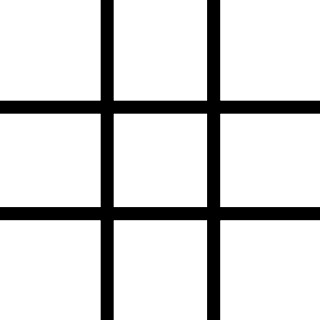

# 🎮 Tic Tac Toe

A modern, responsive Tic Tac Toe game built with **HTML**, **CSS**, and **JavaScript**. Play against another player in a clean and interactive interface.

## 🚀 Live Demo

🔗 https://majestic-croquembouche-4ec6cc.netlify.app/

---

## 📸 Preview

> 


```md

```

---

## ✨ Features

- 🎯 Two-player gameplay
- ✅ Automatic win detection
- 🤝 Draw detection
- 🔄 Restart game functionality
- 📱 Responsive design
- 🎨 Clean and modern user interface

---

## 🛠️ Built With

- HTML5
- CSS3
- JavaScript (Vanilla JS)

---

## 📂 Project Structure

```
tic-tac-toe/
│── index.html
│── style.css
│── script.js
│── board.png
│── o.png
│── x.png
│── README.md
```

---

## ▶️ Getting Started

### Clone the repository

```bash
git clone https://github.com/Nisarahmed-Hidayeti/Tic-tac-toe.git
```

### Navigate to the project

```bash
cd Tic-tac-toe
```

### Run the project

Simply open `index.html` in your browser.

No installation or dependencies required.

---

## 🎮 How to Play

1. Player **X** starts the game.
2. Players take turns placing their marks.
3. The first player to get **three in a row** (horizontal, vertical, or diagonal) wins.
4. If all squares are filled without a winner, the game ends in a draw.

---

## 🌟 Future Improvements

- 🤖 Single-player mode with AI
- 🔊 Sound effects
- 🌙 Dark/Light theme toggle
- 🏆 Scoreboard
- 🎉 Winning animations

---

## 🤝 Contributing

Contributions are welcome!

1. Fork the repository
2. Create a new branch

```bash
git checkout -b feature-name
```

3. Commit your changes

```bash
git commit -m "Add new feature"
```

4. Push to your branch

```bash
git push origin feature-name
```

5. Open a Pull Request

---

## 📄 License

This project is licensed under the MIT License.

---

## 👨‍💻 Author

**Nisar Ahmed Hidayeti**

GitHub: https://github.com/Nisarahmed-Hidayeti

---

⭐ If you like this project, consider giving it a star!
